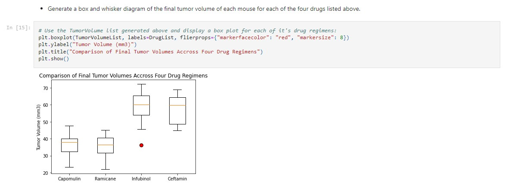

<h1> Pymaceuticals   (A Demonstration of Matplotlib Visualizations in Data Analysis) </h1>

#### Overview:
This project analyzes a fictitious cancer treatment drug study.
The analysis is performed in a Jupyter notebook (see "pymaceuticals.ipynb").
The notebook first merges and cleans the raw data contained in two CSV files. 
It then tabulates several statistics using Pandas and then illustrates further analyses using Matplotlib.

To examine the code and data files, their locations are indicated in the tree below:

#### Folders/Files:

> **"Pymaceuticals"** (main folder)  
> - *"pymaceuticals.ipynb"* (jupyter notebook file containing python/pandas code)  
> - **"data"** (subfolder)  
>	- *"Mouse_metadata.csv"* (input data file)  
> 	- *"Study_results.csv"* (input data file)  
	
(Please do not move, rename, delete, or alter!)

#### Code Samples:  

  
  
  
  
